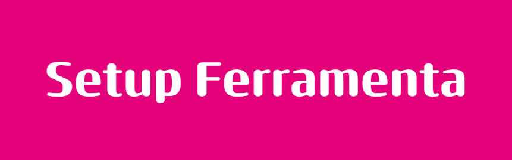
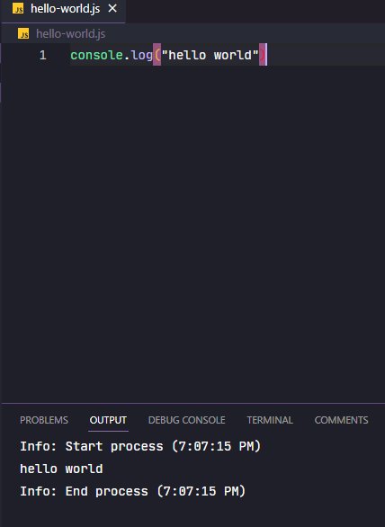

<h3 align="center">
  Cubos Academy: Primeiro Exercício

</h3>

  
  

---

#  Sobre o Exercício.

Uma task simples, porém muito importante para o começo de todos os programadores, em resumo foi ensinado a baixar/configurar as ferramentas de desenvolvimento baseado em seu sistema operacional, além de uma leve introdução aos comandos git.
##### **Ferramentas: VSCODE | GIT | GITHUB | NODE.JS**

---

---

## FeedBack do Exercício
  - Como o foco foi baixar as ferramentas acham que está de bom tamanho, porém penso que **git** e **node** devem ser abordados mais a profundamente.
---

